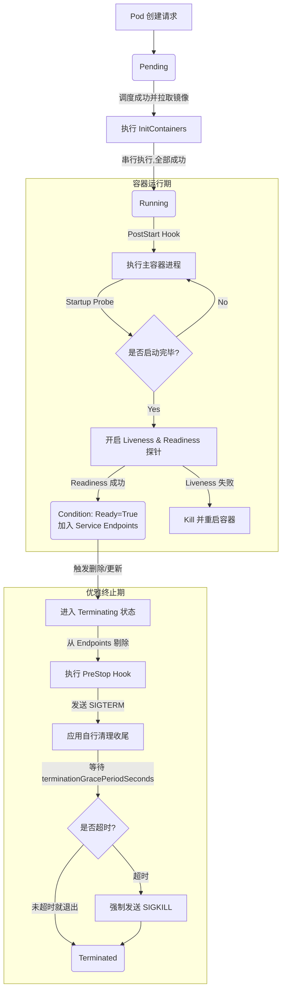

# 06 - 核心业务流程

前面五章介绍了 K8s 的各个组件和资源，本章将它们串联起来，理解完整的业务流程。

---

## 6.1 Pod 创建全流程

当用户执行 `kubectl apply` 创建一个 Deployment 时，从请求到容器运行经历以下步骤：

```
用户 kubectl apply
       │
       ▼
┌─ kube-apiserver ─────────────────────────────────┐
│  1. 认证（Authentication）                        │
│  2. 鉴权（Authorization / RBAC）                  │
│  3. Mutating Admission（注入 sidecar 等）          │
│  4. Schema 校验                                   │
│  5. Validating Admission（策略校验）               │
│  6. 写入 etcd                                     │
└──────────────┬───────────────────────────────────┘
               │
               ▼
┌─ Deployment Controller ─────────────────────────┐
│  7. 检测到新 Deployment                           │
│  8. 创建 ReplicaSet                               │
│  9. ReplicaSet 创建 Pod（写入 etcd，nodeName 为空）│
└──────────────┬───────────────────────────────────┘
               │
               ▼
┌─ kube-scheduler ────────────────────────────────┐
│  10. 发现未绑定节点的 Pod（nodeName 为空）         │
│  11. Filter：排除不满足约束的 Node                  │
│  12. Score：对候选 Node 打分                       │
│  13. Bind：将 Pod 绑定到最优 Node（写入 etcd）     │
└──────────────┬───────────────────────────────────┘
               │
               ▼
┌─ kubelet（目标 Node）───────────────────────────┐
│  14. Watch 发现调度到本节点的 Pod                  │
│  15. 调用 CRI 创建 Pod Sandbox（Pause 容器）       │
│  16. 拉取容器镜像（ImageService.PullImage）        │
│  17. 启动 Init Containers（依次运行到完成）        │
│  18. 启动主容器（RuntimeService.CreateContainer）  │
│  19. 挂载 Volume（ConfigMap/Secret/PVC）           │
│  20. 注入环境变量                                  │
│  21. 启动容器（RuntimeService.StartContainer）     │
│  22. 开始探针检测（Startup → Liveness → Readiness）│
│  23. 向 apiserver 汇报 Pod 状态                    │
└──────────────────────────────────────────────────┘
```

### 关键节点详解

**Admission Controller 阶段（步骤 3-5）：**

```
Mutating Admission（可修改请求）
  → ServiceAccount 自动注入
  → Sidecar 注入（如 Istio envoy）
  → 默认 StorageClass 注入
  → Pod Tolerations 注入

Schema Validation（校验资源格式）

Validating Admission（只读校验，不可修改）
  → PodSecurityPolicy / PodSecurity
  → ResourceQuota 检查
  → LimitRange 检查
  → 自定义 Webhook（OPA/Gatekeeper）
```

**调度决策（步骤 10-13）：**

```
Filter 阶段（硬性约束，排除不合格 Node）:
  - NodeSelector 匹配？
  - NodeAffinity 满足？
  - Taint/Toleration 匹配？
  - 资源充足？(CPU/Memory/存储)
  - 端口未冲突？
  - PVC 可绑定？

Score 阶段（软性偏好，候选 Node 评分）:
  - 资源均衡度（避免 Node 资源倾斜）
  - NodeAffinity 偏好加分
  - Pod 反亲和加分（分散部署）
  - 数据本地性加分
  - 自定义打分插件
```
---

## 6.1a 深入剖析：Pod 内部生命周期与状态流转

上一节我们从 K8s 全局组件的角度看了 Pod 是怎么被创建的。现在我们**将视角切换到 Pod 自身**，看看它从被分配到节点，到运行，再到销毁的整个微观状态流转。

一个 Pod 在 K8s 中的状态判定，实际上是由宏观的 **Phase (阶段)**、微观的 **ContainerState (容器状态)** 以及具体的 **Conditions (探针状况)** 三个维度共同拼凑出来的。

### 1. 宏观：Pod Phase (Pod 阶段)
这是你在 `kubectl get pods` 时最常看到的大状态：
* **Pending (挂起)**：Pod 已经被 K8s 接受，但还在等调度，或者在等下载镜像。
* **Running (运行中)**：Pod 已经绑定到 Node，且**至少有一个核心容器**正在运行、正在启动或正在重启。*(注意：Running 不代表你的服务可用，只代表进程跑起来了！)*
* **Succeeded (成功)**：所有容器都已成功终止，且不会再重启（通常是 Job/CronJob 跑完了）。
* **Failed (失败)**：所有容器都已终止，且至少有一个容器是因为失败（非 0 状态码）而终止的。
* **Unknown (未知)**：APIServer 无法获取 Pod 状态（通常是 Node 失联了）。

### 2. 微观：Container State (容器内部状态)
Pod 的 Phase 是由其内部每个容器的 State 决定的。容器只有三种状态：
* **Waiting (等待)**：容器在拉取镜像、等待 Secret 创建，或者因为崩溃正在等待 Backoff 重启。
* **Running (运行中)**：容器的主进程正在运行。
* **Terminated (已终止)**：容器运行结束（成功执行完毕或崩溃）。你可以通过 `exitCode` 来判断具体原因（0 代表正常，非 0 如 137 代表被 OOMKill 或 SIGKILL）。

### 3. 里程碑：Pod Conditions (Pod 状况) & Probes (探针)
这是决定 Pod 是否真的“准备好接客”的关键。Pod 有一个 `Conditions` 数组，就像它的体检报告，包含 4 项：
1. **PodScheduled**：Pod 是否已经被调度到节点？
2. **Initialized**：所有的 Init 容器是否都已经成功运行完毕？
3. **ContainersReady**：Pod 里所有的普通容器是不是都 Ready 了？
4. **Ready**：整个 Pod 是否可以开始接收 Service 转发过来的流量了？

**这 4 项怎么变成 True 的？这就引出了探针 (Probes)：**
* **Startup Probe (启动探针)**：专治“慢启动”应用。在它成功前，其他探针全部被挂起禁用。
* **Liveness Probe (存活探针)**：判断进程是否“假死”。如果失败，kubelet 会**杀掉容器并重启它**。
* **Readiness Probe (就绪探针)**：判断应用是否“能接客”。如果失败，kubelet 会**把该 Pod 从 Service 的 Endpoints 列表中剔除**，但绝不会重启容器！

### 4. Pod 的完整生命周期流水线

让我们把这些概念串成一条完整的时间线：



**防坑重点：优雅终止（Graceful Shutdown）为什么这么重要？**
在微服务场景下，如果你没有配置 `preStop` hook，或者你的代码忽略了 `SIGTERM` 信号，当 Pod 被删除时，K8s 会直接在几秒内切断网络并强制 `SIGKILL` 杀掉进程。这会导致那些正在处理中、还没返回结果的用户请求全部报 502/504 错误。合理的做法是捕获 `SIGTERM`，停止接收新请求，并利用这 30 秒默认的宽限期把手里现有的活儿干完再退出。

---
## 6.2 服务发现流程

Pod 如何找到并访问其他服务？

```
┌─────────────────────────────────────────────────────────┐
│                      Service 创建                        │
│                                                         │
│  1. 用户创建 Service（selector: app=webapp）              │
│  2. Endpoints Controller 监听，找到匹配的 Pod             │
│  3. 创建 Endpoints 对象，记录 Pod IP:Port                 │
│  4. kube-proxy 监听 Service/Endpoints 变化                │
│  5. 在每个 Node 上写入 iptables/IPVS 规则                 │
│  6. CoreDNS 为 Service 创建 DNS A 记录                    │
└─────────────────────────────────────────────────────────┘

┌─────────────────────────────────────────────────────────┐
│                   请求访问流程                            │
│                                                         │
│  Pod A 发起请求：                                        │
│    curl http://webapp-svc:80                             │
│         │                                               │
│         ▼                                               │
│  ① DNS 解析（CoreDNS）                                   │
│    webapp-svc.default.svc → 10.96.0.100                 │
│         │                                               │
│         ▼                                               │
│  ② 请求发到 ClusterIP（虚拟 IP，不绑定网卡）              │
│         │                                               │
│         ▼                                               │
│  ③ iptables/IPVS DNAT（由 kube-proxy 维护）              │
│    10.96.0.100:80 → 10.244.1.5:8080 (Pod B)             │
│                  → 10.244.2.8:8080 (Pod C)              │
│                  → 10.244.3.2:8080 (Pod D)              │
│         │                                               │
│         ▼                                               │
│  ④ 流量直达后端 Pod（无中间代理）                         │
└─────────────────────────────────────────────────────────┘
```

> **🔥 核心防坑提示：负载均衡到底在哪发生？**
> 很多开发者误以为请求 Service 是通过 DNS 轮询到不同 Pod 实现的。请注意：
> - **① 阶段（CoreDNS）**：永远只返回固定唯一的虚拟 ClusterIP，**绝对不负责负载均衡**。
> - **③ 阶段（内核劫持）**：真正的负载均衡是在**发起方所在节点的 Linux 内核中**发生的。内核依据 `kube-proxy` 写好的规则（如 iptables 的随机概率，或 IPVS 算法），将数据包的目标 IP 强行改写为真正的 Pod IP。内核无需记录上一次分配给了谁，纯靠概率计算实现完美分发。

### Session Affinity（会话亲和）

```yaml
spec:
  sessionAffinity: ClientIP        # 同一客户端 IP 始终访问同一 Pod
  sessionAffinityConfig:
    clientIP:
      timeoutSeconds: 3600
```

### 服务发现方式对比

| 方式 | 说明 | 适用场景 |
|------|------|---------|
| **环境变量** | `WEBAPP_SVC_SERVICE_HOST=10.96.0.100` | 简单场景，Pod 启动后 Service 不变 |
| **DNS（推荐）** | `webapp-svc.default.svc.cluster.local` | 通用场景，动态解析 |

环境变量在 Pod 创建时注入，如果 Service 在 Pod 之后创建则环境变量不存在。DNS 无此问题。

---

## 6.3 滚动更新流程

Deployment 的滚动更新是 K8s 最核心的发布策略，保证服务在更新过程中不中断。

### 完整流程

```
初始状态 (replicas=3, image=v1):
  RS-v1: [Pod-1] [Pod-2] [Pod-3]        ← 处理所有流量

用户更新 image 为 v2:
  Deployment Controller 介入

策略: maxSurge=1, maxUnavailable=0
  → 总数上限 3+1=4, 可用下限 3

Step 1: 创建 RS-v2，启动 1 个 v2 Pod
  RS-v1: [Pod-1] [Pod-2] [Pod-3]
  RS-v2: [Pod-4(v2)] (启动中)

Step 2: Pod-4 Readiness Probe 通过，加入 Service Endpoints
  RS-v1: [Pod-1] [Pod-2] [Pod-3]
  RS-v2: [Pod-4(v2)] ✓

Step 3: 缩减 RS-v1（总数不超过 4，可用不低于 3）
  RS-v1: [Pod-1] [Pod-2]                 ← Pod-3 被终止
  RS-v2: [Pod-4(v2)] ✓  [Pod-5(v2)] (启动中)

Step 4: 继续滚动...
  RS-v1: [Pod-1]
  RS-v2: [Pod-4] ✓ [Pod-5] ✓ [Pod-6(v2)] (启动中)

Step 5: 更新完成
  RS-v1: (replicas=0, 保留 RS 对象用于回滚)
  RS-v2: [Pod-4] ✓ [Pod-5] ✓ [Pod-6] ✓
```

### 关键配置

```yaml
strategy:
  type: RollingUpdate
  rollingUpdate:
    maxSurge: 25%            # 最多多出 25% 的 Pod（向上取整）
    maxUnavailable: 25%      # 最多允许 25% 不可用（向下取整）
```

**不同策略对比：**

| 配置 | 效果 | 适用场景 |
|------|------|---------|
| maxSurge=1, maxUnavailable=0 | 零停机，速度慢 | 关键服务 |
| maxSurge=25%, maxUnavailable=25% | 平衡速度与可用性 | 通用场景 |
| maxSurge=0, maxUnavailable=1 | 先删后建，有短暂中断 | 资源受限 |

### Pod 终止流程

```
Pod 被标记为终止
  │
  ├─ 1. 从 Service Endpoints 移除（停止接收新流量）
  │
  ├─ 2. preStop Hook 执行（清理、连接排空）
  │      - HTTP 回调或 Exec 命令
  │      - 例如：从负载均衡器注销
  │
  ├─ 3. 发送 SIGTERM 信号
  │
  ├─ 4. 等待 terminationGracePeriodSeconds（默认 30s）
  │      - 应用处理完现有请求后退出
  │      - 超时后发送 SIGKILL 强制终止
  │
  └─ 5. Pod 状态变为 Succeeded/Failed，kubelet 清理
```

### preStop Hook 示例

```yaml
containers:
- name: app
  image: myapp:1.0
  lifecycle:
    preStop:
      exec:
        command: ["/bin/sh", "-c", "sleep 15"]
        # 等待 15 秒确保 iptables 规则已更新
        # 避免终止过程中仍有新流量进入
```

---

## 6.4 弹性伸缩

K8s 提供三个层次的自动伸缩能力：

```
                   ┌──────────────────────────────────┐
                   │     Cluster Autoscaler           │
                   │     (节点级别)                    │
                   │     自动增减 Node 数量            │
                   └──────────┬───────────────────────┘
                              │ 资源不足时扩容节点
                              ▼
┌──────────────────────────────────────────────────────────┐
│                   Horizontal Pod Autoscaler (HPA)        │
│                   (Pod 数量级别)                          │
│                   根据指标自动增减 Pod 副本数              │
└──────────────────────────────────────────────────────────┘
                              │
                              ▼
┌──────────────────────────────────────────────────────────┐
│                   Vertical Pod Autoscaler (VPA)          │
│                   (Pod 资源级别)                          │
│                   自动调整单个 Pod 的 CPU/Memory 限制      │
└──────────────────────────────────────────────────────────┘
```

### HPA — 水平伸缩

```yaml
apiVersion: autoscaling/v2
kind: HorizontalPodAutoscaler
metadata:
  name: webapp-hpa
spec:
  scaleTargetRef:
    apiVersion: apps/v1
    kind: Deployment
    name: webapp
  minReplicas: 2
  maxReplicas: 20
  metrics:
  - type: Resource
    resource:
      name: cpu
      target:
        type: Utilization
        averageUtilization: 70     # CPU 使用率 > 70% 时扩容
  - type: Resource
    resource:
      name: memory
      target:
        type: Utilization
        averageUtilization: 80     # 内存使用率 > 80% 时扩容
  - type: Pods                    # 自定义指标
    pods:
      metric:
        name: http_requests_per_second
      target:
        type: AverageValue
        averageValue: "1000"       # 每 Pod QPS > 1000 时扩容
  behavior:                       # 伸缩行为控制
    scaleDown:
      stabilizationWindowSeconds: 300   # 缩容前稳定 5 分钟（防抖动）
      policies:
      - type: Pods
        value: 1                        # 每次最多缩 1 个
        periodSeconds: 60
    scaleUp:
      stabilizationWindowSeconds: 0     # 扩容立即执行
      policies:
      - type: Pods
        value: 4                        # 每次最多扩 4 个
        periodSeconds: 60
```

**HPA 算法：**

```
期望副本数 = ceil[当前副本数 × (当前指标值 / 目标指标值)]

例：当前 3 个 Pod，平均 CPU 85%，目标 70%
期望 = ceil[3 × (85/70)] = ceil[3.64] = 4 → 扩容到 4
```

**依赖组件：**

```
Metrics Server（必须）
  → 收集每个 Node/Pod 的 CPU/Memory 指标
  → HPA 每 15 秒查询一次

Prometheus Adapter（可选，自定义指标）
  → 将 Prometheus 指标转换为 K8s custom/external metrics
```

### VPA — 垂直伸缩

```yaml
apiVersion: autoscaling.k8s.io/v1
kind: VerticalPodAutoscaler
metadata:
  name: webapp-vpa
spec:
  targetRef:
    apiVersion: apps/v1
    kind: Deployment
    name: webapp
  updatePolicy:
    updateMode: "Auto"        # Auto | Initial | Off
    # Auto: 自动调整并重启 Pod
    # Initial: 只在 Pod 创建时设置
    # Off: 只推荐，不自动调整
  resourcePolicy:
    containerPolicies:
    - containerName: "*"
      minAllowed:
        cpu: "50m"
        memory: "64Mi"
      maxAllowed:
        cpu: "2"
        memory: "2Gi"
```

### Cluster Autoscaler — 集群伸缩

Cluster Autoscaler 根据 Pending Pod 自动扩容节点，根据资源利用率自动缩容节点。

```
扩容触发：
  Pod 无法调度（Pending）→ 没有 Node 满足资源需求
    → Cluster Autoscaler 向云厂商请求新 Node
    → 新 Node Ready → Pod 调度成功

缩容触发：
  Node 利用率 < 50% 持续 10 分钟
    → 检查该 Node 上的 Pod 能否迁移到其他 Node
    → 如果可以 → 驱逐 Pod → 删除 Node
```

### 三者配合

```
流量高峰：
  HPA 扩 Pod → Pod 数量增加
    → 资源不足 → Cluster Autoscaler 扩 Node
      → 新 Node Ready → Pending Pod 调度成功

流量低谷：
  HPA 缩 Pod → Pod 数量减少
    → Node 利用率下降 → Cluster Autoscaler 缩 Node
      → Pod 迁移到其他 Node → 删除空闲 Node

VPA 持续优化：
  监控实际资源使用 → 推荐合理的 requests/limits
    → 减少资源浪费，提升调度准确性
```

---

## 本章小结

| 流程 | 核心链路 | 关键组件 |
|------|---------|---------|
| Pod 创建 | kubectl → apiserver → etcd → scheduler → kubelet → 容器运行时 | 全链路协作 |
| 服务发现 | DNS 解析 → ClusterIP → iptables/IPVS DNAT → 后端 Pod | CoreDNS, kube-proxy |
| 滚动更新 | 新 RS 扩容 → Readiness 通过 → 旧 RS 缩容 → 零停机 | Deployment Controller |
| 弹性伸缩 | HPA 调副本数, VPA 调资源量, CA 调节点数 | Metrics Server, Prometheus |

**上一章：[05-配置与存储](05-配置与存储.md)** | **下一章：[07-案例-Web应用部署](07-案例-Web应用部署.md)** →
